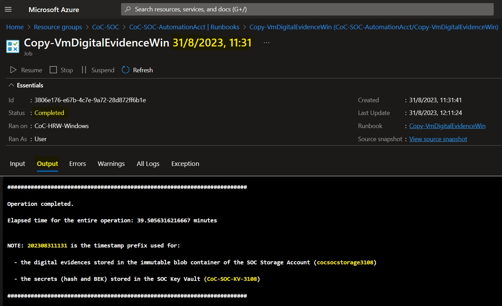
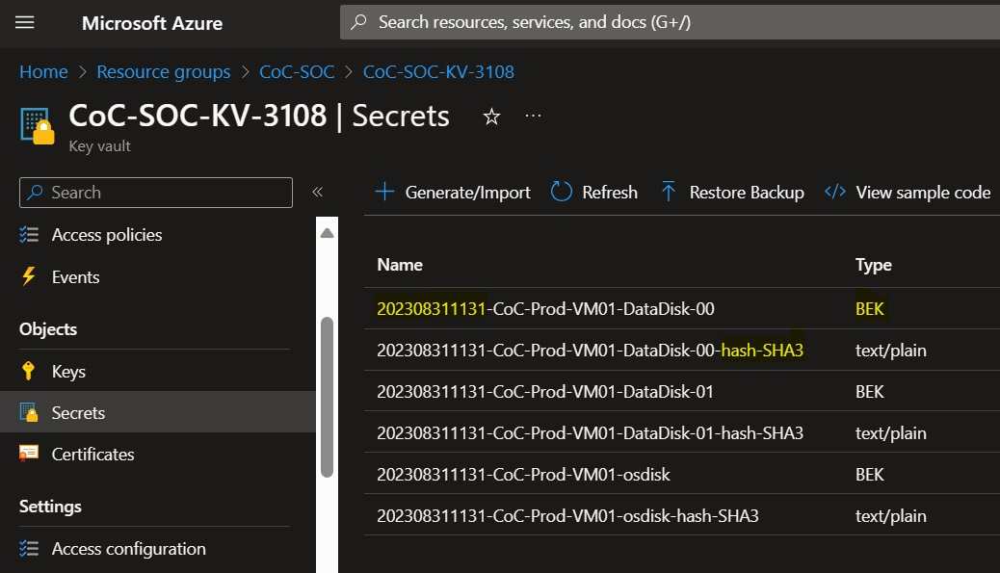

# CoC LAB Deployment
This guide details the process of deploying the LAB environment for the [Computer Forensics Chain of Custody in Azure](https://learn.microsoft.com/en-us/azure/architecture/example-scenario/forensics/)

[](https://portal.azure.com/#create/Microsoft.Template/uri/https%3A%2F%2Fraw.githubusercontent.com%2Ffabmas%2Fcoc%2Fmain%2F.armtemplate%2Fcoc-main.json)

To initiate the deployment of the LAB environment, click on the **Deploy to Azure** button provided above. This action will trigger the deployment process within the Azure Portal. You will be prompted to provide the following parameters:

> [!NOTE]
> For resources such as storage accounts, key vaults, etc., which necessitate globally unique names, kindly replace the \<UNIQUESTRING> placeholder with a unique string of your choice, following the resource's constraints (e.g., maximum character count, lowercase only, etc.).

| Parameter | Description | Default value |
|-----------|-------------|---------------|
|Subscription|The subscription where the resource groups will be deployed|Current subscription|
|Region|The region where the deployment start. NOTE: All the resources will be deployed in the region defined in the *Coc-Location* paramter below||
|Coc-Location|The region where the resources will be deployed.|westeurope|
|Coc-prod-rg_name |The name of the resource group for the Production environment|CoC-Production|
|Coc-prod-vnet_name |The name of the virtual network for the Production environment|CoC-Production-vnet|
|Coc-prod-nsg_name |The name of the network security group for the Production environment|CoC-Production-vnet-server-nsg|
|Coc-prod-keyvault_name |The name of the key vault for the Production environment|CoC-Production-keyvault-\<UNIQUESTRING>|
|Coc-prod-VM01_name |The name of the VM for the Production environment|CoC-Prod-VM01|
|Coc-prod-VM01_adminUsername |The name of the admin user for the VM for the Production environment|cocprodadmin|
|Coc-prod-VM01_adminPassword|The password of the admin user for the VM for the Production environment||
||||
|Coc-soc-rg_name |The name of the resource group for the SOC environment|CoC-SOC|
|Coc-soc-vnet_name |The name of the virtual network for the SOC environment|CoC-SOC-vnet|
|Coc-soc-nsg_name |The name of the network security group for the SOC environment|CoC-SOC-vnet-soc-subnet01-nsg|
|Coc-soc-keyvault_name |The name of the key vault for the SOC environment|CoC-SOC-keyvault-\<UNIQUESTRING>|
|Coc-soc-storageAccount_name |The name of the storage account for the SOC environment|cocsocstorage-\<UNIQUESTRING>|
|Coc-soc-LogAnWks_name |The name of the Log Analytics Workspace for the SOC environment|CoC-SOC-LogAnWks-\<UNIQUESTRING>|
|Coc-soc-automatioAccount_name |The name of the automation account for the SOC environment|CoC-SOC-AutomationAcct|
|CoC-SOC-workerGroup_name|The name of the Hybrid Worker Group for the SOC environment|CoC-HRW-Windows|
|Coc-soc-HRW_VM_name |The name of the Hybrid RunBook Worker VM for the SOC environment|CoC-SOC-HRW|
|Coc-soc-HRW_adminUsername |The name of the admin user for the Hybrid RunBook Worker VM for the SOC environment|cocsocadmin|
|Coc-soc-HRW_adminPassword |The password of the admin user for the Hybrid RunBook Worker VM for the SOC environment||


> [!NOTE]
> The deployment process is expected to take approximately 5 minutes to complete.


## LAB environment description
The LAB environment represents a simplified version of the architecture described in the [article](https://learn.microsoft.com/en-us/azure/architecture/example-scenario/forensics/) deploying two resource groups within the same subscription. The first resource group simulates the **Production Environment**, housing Digital Evidence, while the second resource group holds the **SOC Environment**.


The Production resource group contains:
1. A **virtual network** containing a subnet and network security group for subnet protection.
1. A **Windows Server 2022 VM** featuring a public IP address, an OS disk, and two data disks configured with Azure Disk Encryption (ADE).
1. A **key vault** designed to store the BEK keys of the encrypted disks.

The SOC resource group contains:
1. A **virtual network** with a subnet and network security group for subnet protection.
1. A **Windows Server 2022 VM** functioning as a Hybrid RunBook Worker (HRW). The HRW is automatically configured with the necessary PowerShell modules for executing the Chain of Custody process.
1. A **storage account** for storing the digital evidence with:
    1. a blob container named *immutable* automatically configured with the [Legal Hold](https://docs.microsoft.com/en-us/azure/storage/blobs/storage-blob-immutability-policies-overview) feature
    1. a file share named *hash* used for calculating digital evidence hashes.
1. A **key vault** for storing, in the SOC environment, a copy of the BEK keys and the hash of the digital evidence processed.
1. An **automation account** configured with:
    1. A RunBook implementing the Chain of Custody process as outlined in the [article](https://learn.microsoft.com/en-us/azure/architecture/example-scenario/forensics/)
    1. Variables for the RunBook, automatically populated with SOC environment values.
    1. A System Managed Identity granted necessary permissions for both Production and SOC resource groups.
    1. An Hybrid Worker Group containing the Hybrid RunBook Worker (HRW) VM

## Executing the Chain of Custody process in the LAB environment
Access the automation account within the SOC resource group and navigate to the **RunBooks** blade. Select the **Copy-VmDigitalEvidenceWin** RunBook and click on the **Start** button. Within the **Start RunBook** blade specify the following parameters:

|Parameter|Description|Sample value|
|--------|-----------|------------|
|SUBSCRIPTION ID|The subscription ID where the Production resource group is deployed|xxxxxxxx-xxxx-xxxx-xxxx-xxxxxxxxxxxx|
|RESOURCEGROUPNAME|The name of the Production resource group|CoC-Production|
|VIRTUALMACHINENAME|The name of the VM in the Production resource group|CoC-Prod-VM01|
|CALCULATEHASH|If true the RunBook will calculate the hash of the digital evidence. Supported values are TRUE or FALSE| TRUE|
|HASHALGORITHM|The algorithm used to calculate the hash of the digital evidence. Supported Values are MD5, SHA256, SKEIN, KECCAK (or SHA3)|SHA256|

> [!NOTE]
> The RunBook applied to the LAB's deployed VM will take around 45 minutes to complete (or 15 minutes without hash calculation). Completion time depends on attached disk sizes. Hash calculation is time-intensive, executed via parallel jobs for faster processing across all disks.

Once the job concludes, examine the job's Output to verify successful completion.



The output shows the name of the digital evidence composed by a timestamp prefix followed by the name of the disk. For example the prefix for a job started on 8th August 2023 at 14:30 UTC will be *202308081430_*.  
The digital evidence is stored in the *immutable* blob container of the storage account in the SOC resource group and can be downloaded for inspection. 

The hash of the digital evidence is stored in the Key Vault of the SOC stored with the same name of the digital evidence followed by the suffix "-hash" and the algorithm used. The BEK keys are stored in the key vault of the SOC with the name of the digital evidence.

After downloading digital evidence, recalculate the hash for comparison with the Key Vault-stored hash to verify integrity.

> [!NOTE]
> The [Appendixes](#appendixes---hash-utility) section below provides a PowerShell script to recalculate the hash of the digital evidence.

For digital evidence decryption, get the BEK keys from the SOC environment's Key Vault and follow instructions outlined in the [article](https://learn.microsoft.com/en-us/azure/architecture/example-scenario/forensics/#evidence-retrieval).

## Remove the LAB environment
To remove the LAB environment, delete the resource groups created for the Production and SOC environments. Please note that to delete the SOC resource group, you must first delete the Legal Hold Access Policy from the *immutable* container in the storage account as shown in the screenshots below.


## Appendixes - Hash utility
For your convenience, you can utilize the provided [zip file](https://famascicoc.blob.core.windows.net/utilities/Hash.zip) to recalculate the hash file on your end. The zip file includes a PowerShell script and the corresponding DLL.

Run the *hash.ps1* Powershell script providing the following parameters:

**-FileList**: comma-separated list of files to be hashed <BR>
**-HashAlgorithm**: the algorithm used to calculate the hash of the digital evidence. Supported Values are *MD5, SHA256, SKEIN, KECCAK (or SHA3)*

This is a sample command to calculate the MD5 hash of 3 files:
```powershell
.\hash.ps1 -FileList "C:\temp\osdisk.vhd", "C:\temp\datadisk-00.vhd" ,"C:\temp\datadisk-01.vhd" -HashAlgorithm MD5   
```
